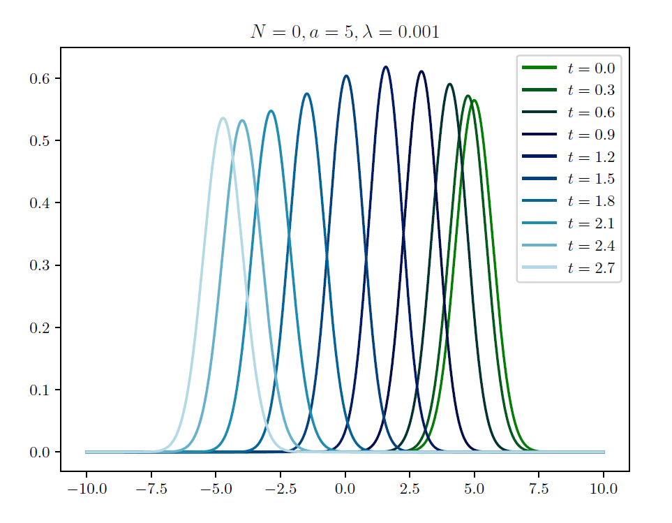

For this project I solved (time-evolved) Schrődinger's equation.
Spatial derivates were discretised with the usual finite differences, while the time evolution operator was expanded in the Taylor series. I also used an alternative, unitary approximation of the time evolution operator.

    

