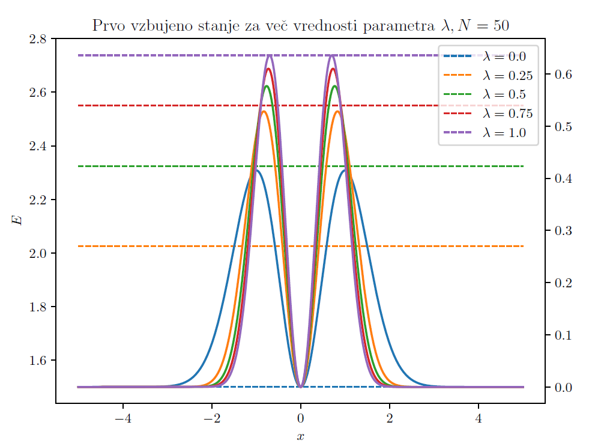

For this project I found the (approximate) eigenfunctions of the Hamiltonian using perturbation theory.
Additionally, a semiclassical approximation was used to estimate the number of converged eigenstate. Lanczos' iterative algorithm for finding the lowest energy states was also tested.

    

