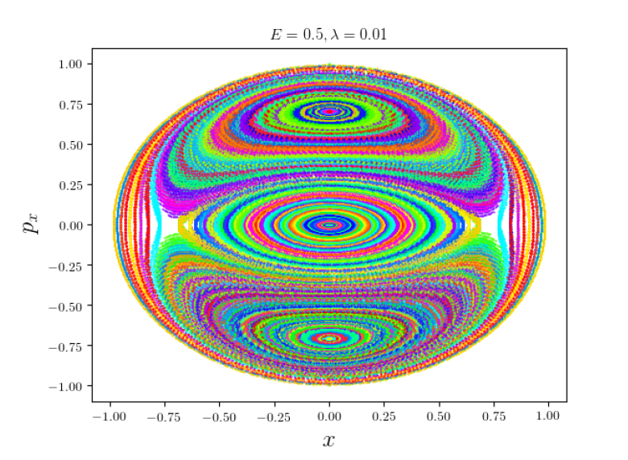

In this project I have implemented a symplectic integrator using the Trotter-Suzuki decomposition.
I have then applied it to solve a 2D anharmonic oscillator and proceeded to analye its properties (validity of Liouville's theorem and transition into chaos)

    

