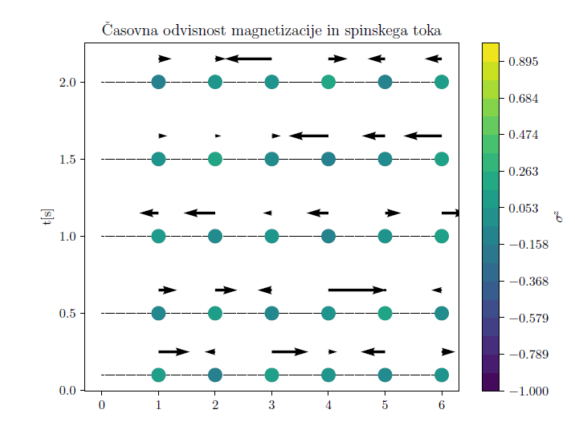

In this project I have applied the Trotter-Suzuki decomposition to treat a quantum manybody system, using it 
to calculate some thermal expectation values (energy, magnetisation and spin current).

    

