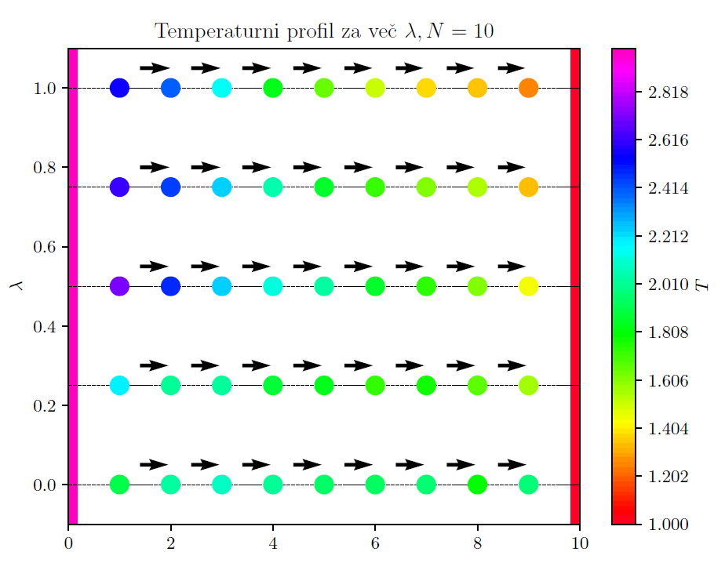

For this project I simulated the behaviour of an anharmonic atom chain, coupled to a thermostat.
I've tested both the Nose-Hoover and Maxwell thermostats and calculated the temperature profiles obtained.

    

