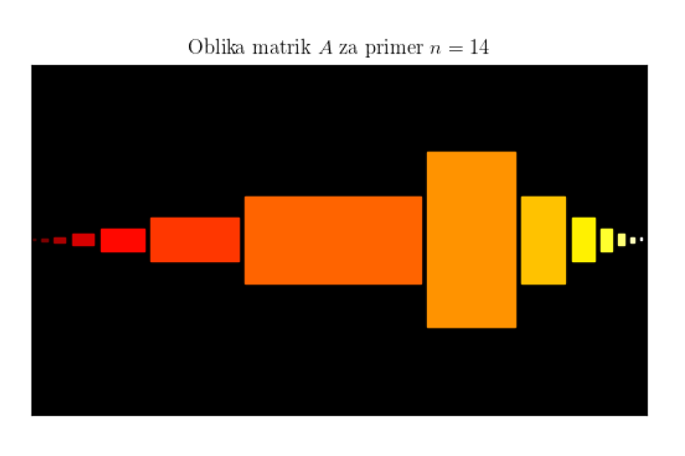

For this project I became familiar with the Matrix Product Ansatz (MPA) method for the analysis of 1D problems.
Using MPA and Schmidt decomposition, I calculated the entanglement entropy between two partitions of a Heisenberg chain.

    

